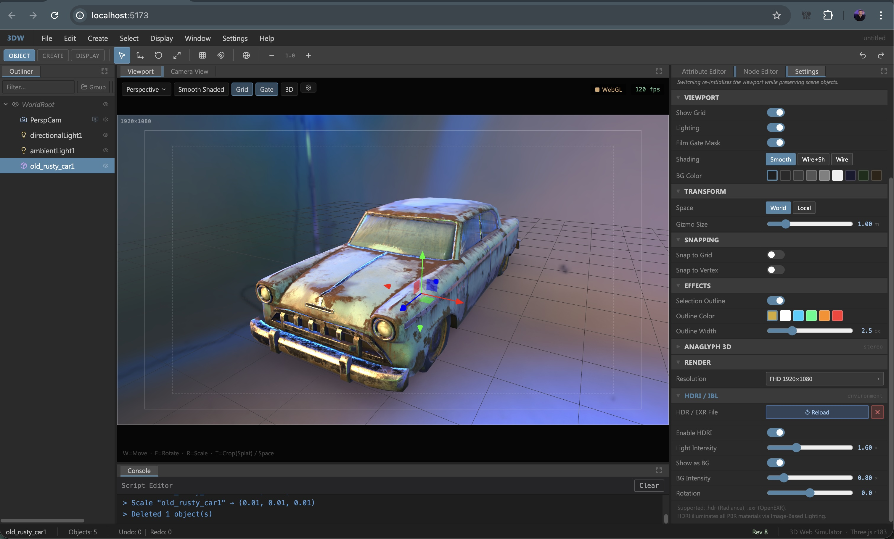
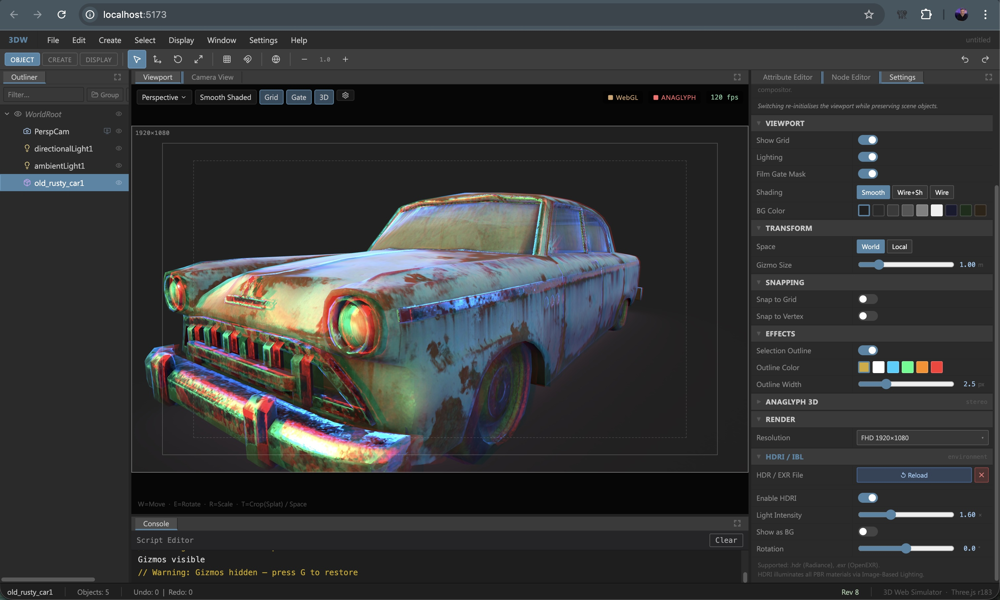
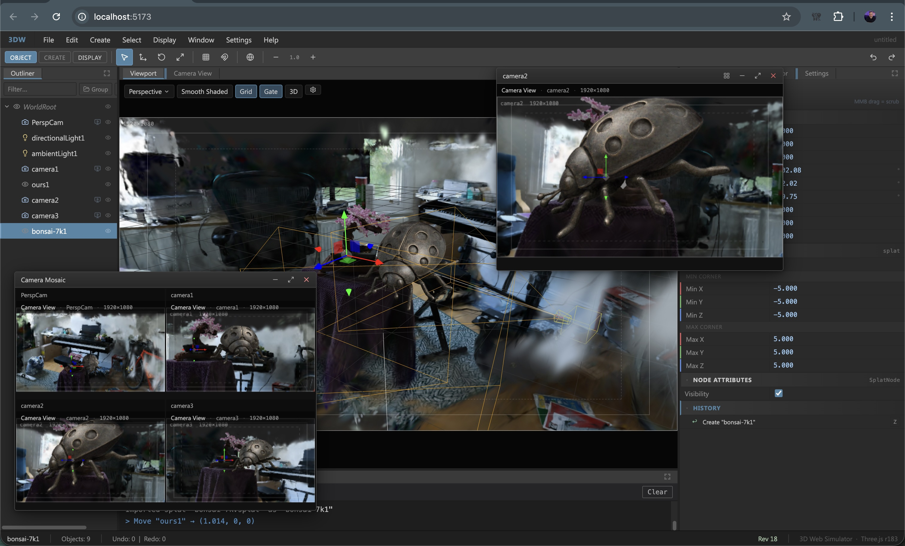

# 3DW — Maya-inspired 3D DCC Web App

A browser-based 3D digital-content-creation (DCC) tool modelled after Autodesk Maya. Built with **React 19**, **TypeScript 5**, **Three.js r183** (WebGPU renderer with WebGL fallback), **Spark 2.0** (GPU-accelerated Gaussian splatting), and **Vite 7**.

---

## Screenshots

| HDRI / IBL lighting on a GLTF model | Anaglyph 3D stereo mode |
|---|---|
|  |  |


*Gaussian splat scene with Camera Mosaic overlay, floating camera view window, and crop volume controls*

---

## Tech stack

| Layer | Library / version |
|---|---|
| UI framework | React 19 + TypeScript 5 |
| Build tool | Vite 7 |
| 3D renderer | Three.js r183 — WebGPU primary, WebGL fallback |
| Gaussian splatting | `@sparkjsdev/spark` v2.0.0-preview + `gsplat` v1.2.9 |
| State management | Zustand v5 |
| Layout | FlexLayout-React v0.8 |
| Icons | Lucide-React |
| CSS utilities | Tailwind CSS v4 + clsx + tailwind-merge |
| Test runner | Vitest 4 |

---

## Getting started

```bash
npm install
npm run dev        # start dev server (http://localhost:5173)
npm run build      # tsc + vite build → dist/
npm run preview    # preview the production build
npm run lint       # ESLint
```

> **Requirements:** Node 20+, a browser with WebGPU support (Chrome 113+, Edge 113+).  
> WebGL is used automatically when WebGPU is unavailable.

---

## Project layout

```
src/
├── App.tsx                        # Root component + global keyboard shortcuts
├── core/
│   ├── EngineCore.ts              # Aggregates SceneGraph, SelectionManager, CommandHistory, Logger
│   ├── dag/
│   │   ├── DAGNode.ts             # Base node (translate / rotate / scale / visibility plugs)
│   │   ├── SceneGraph.ts          # Tree of DAGNodes, root WorldNode
│   │   ├── MeshNode.ts            # Geometry + color plugs (box/sphere/cone/plane)
│   │   ├── CameraNode.ts          # Film-back, focal-length, near/far clip, filmFit plugs
│   │   ├── LightNode.ts           # Directional / point / ambient / spot light plugs
│   │   ├── GroupNode.ts           # Grouping / transform node
│   │   ├── GltfNode.ts            # GLTF/GLB import node (base64-embedded for serialisation)
│   │   ├── SplatNode.ts           # Gaussian Splat node (.spz/.splat/.ply/.ksplat/.sog) + AABB crop plugs
│   │   └── PlyNode.ts             # PLY mesh / point-cloud node
│   ├── dg/
│   │   ├── DGNode.ts              # Dependency-graph node base (UUID, plug map)
│   │   └── Plug.ts                # Typed plug (Float/Bool/String/Vec3/Color, dirty-propagation)
│   ├── system/
│   │   ├── CommandHistory.ts      # Undo / redo stack (jump-to support)
│   │   ├── SelectionManager.ts    # Multi-select + lead-selection
│   │   ├── ConsoleLogger.ts       # Log levels: info / warn / error / command
│   │   ├── Serializer.ts          # JSON scene serialisation / deserialisation (base64 assets)
│   │   └── commands/              # Undoable commands:
│   │       ├── CreateNodeCommand  #   create primitive / camera / light
│   │       ├── DeleteCommand      #   delete selected (restores position on undo)
│   │       ├── DuplicateCommand   #   duplicate selected
│   │       ├── TransformCommand   #   move / rotate / scale (multi-node)
│   │       ├── CreateGroupCommand #   group selected nodes
│   │       ├── UngroupCommand     #   flatten a group
│   │       ├── ReparentCommand    #   drag-reparent in Outliner
│   │       ├── ReorderCommand     #   drag-reorder siblings
│   │       └── CropVolumeCommand  #   splat AABB crop bounds change
│   ├── viewport/
│   │   ├── ViewportManager.ts     # Three.js scene, render loop, gizmos, outlines, HDRI, anaglyph
│   │   ├── SplatMesh.ts           # Spark SplatMesh wrapper + crop-box SDF API
│   │   └── CropGizmo.ts           # Interactive AABB manipulator (corner + face handles)
│   └── tests/
│       ├── CameraMath.test.ts
│       └── DependencyGraph.test.ts
├── ui/
│   ├── Layout.tsx                 # FlexLayout panel arrangement + undo/redo shortcuts
│   ├── buses.ts                   # Event buses (toolBus, viewportBus, sceneBus, dispatchScene)
│   ├── store/
│   │   └── useAppStore.ts         # Zustand store (core, VM, selection, viewport settings, scene I/O)
│   ├── components/
│   │   ├── MenuBar.tsx            # Recursive drop-down menu bar (File/Edit/Create/View/Cameras/Windows)
│   │   ├── Toolbar.tsx            # Context shelves: Object / Create / Display
│   │   ├── FloatingWindow.tsx     # Draggable / resizable / minimisable window shell
│   │   ├── FloatingWindowManager  # Stacked floating windows + minimised taskbar strip
│   │   ├── CameraMosaicOverlay    # Auto-grid tiled camera view overlay
│   │   └── GateMask.tsx           # Film-gate mask + action-safe / title-safe guides
│   ├── panels/
│   │   ├── ViewportPanel.tsx      # Main 3D view (camera picker, shading toggle, FPS counter)
│   │   ├── OutlinerPanel.tsx      # Scene hierarchy tree (search, drag-reparent/reorder, icons per type)
│   │   ├── AttributeEditorPanel   # Per-type property inspector + MMB microslider + Command History sub-panel
│   │   ├── CameraViewPanel.tsx    # Pixel-accurate camera preview (action-safe / title-safe overlays)
│   │   ├── SettingsPanelContent   # Preferences: units, renderer, viewport, transform, snapping, effects, anaglyph, HDRI, resolution
│   │   ├── ConsolePanel.tsx       # Live log output with level-based colouring
│   │   └── StatusBar.tsx          # Selected node, object count, undo/redo depth, scene revision
│   └── data/
│       ├── cameraPresets.ts       # Film-back presets (Film, Digital Cinema, DSLR/Mirrorless, Medium/Large Format)
│       └── resolutionPresets.ts   # Render resolution presets (SD/HD, DCI, Square/Social, Aspect ratios)
└── styles/
    └── maya.css                   # CSS custom properties (Maya dark theme)
```

---

## Features

### Viewport
- **Renderer selection** — **WebGPU** (`three/webgpu`) primary; automatic or user-forced **WebGL 2** fallback
- **Gaussian Splatting** — GPU-accelerated via **Spark 2.0** `SparkRenderer` attached to scene (WebGL mode)
- **Orbit controls** — LMB-drag to orbit, RMB to pan, scroll to zoom
- **Transform gizmo** — translate / rotate / scale with `W` / `E` / `R`; world / local space toggle with `T`; detach with `Q`
- **Multi-select transforms** — gizmo delta is propagated to all selected nodes simultaneously
- **Frame selected** — `F` to fit the camera to the current selection
- **Shading modes** — Smooth Shaded, Wireframe on Shaded, Wireframe
- **Grid** — toggleable ground-plane grid helper
- **Lighting toggle** — enable / disable scene lights
- **Film Gate Mask** — renders a crop overlay at the chosen render resolution with action-safe (90%) and title-safe (80%) guides
- **Gate-clipped rendering** — scissor test keeps geometry inside the configured aspect gate
- **Camera picker** — switch the active camera from a drop-down overlay in the viewport
- **Selection outlines** — view-independent outlines on selected objects (configurable colour, thickness, on/off)
- **Anaglyph stereo** — red/cyan 3D anaglyphic rendering with configurable IPD (WebGL color-mask method, no extra render targets)
- **HDRI environment** — load `.hdr` / `.exr` files; PMREM-processed for IBL; configurable intensity, background intensity, Y-rotation, and use-as-background toggle
- **Editor gizmos toggle** — `G` key shows / hides all helper gizmos (camera bodies, light shapes, frustum helpers) à la Unreal Engine
- **FPS counter** — live frames-per-second display in the viewport overlay

### Scene graph
- DAG (directed acyclic graph) with `WorldRoot` → `DAGNode` hierarchy
- **Node types:**
  - **MeshNode** — box / sphere / cone / plane primitives with colour plug
  - **CameraNode** — film-back with focal length, H/V aperture, near/far clip, film-fit mode (Fill / Horizontal / Vertical / Overscan)
  - **LightNode** — directional (with arrow gizmo), point (with helper sphere), spot (with cone gizmo, cone angle + penumbra plugs), ambient (with octahedron indicator)
  - **GroupNode** — transform group (no geometry)
  - **GltfNode** — GLTF/GLB import; `fileData` embedded as base64 for scene serialisation
  - **SplatNode** — Gaussian Splat import (`.spz`, `.splat`, `.ply`, `.ksplat`, `.sog`); AABB crop volume plugs (`cropEnabled`, `cropMin/MaxX/Y/Z`)
  - **PlyNode** — PLY import as mesh or point cloud; `pointSize` plug wired live
- Typed plugs with `onDirty` callbacks for live Three.js sync
- **Visibility plug** — toggle object visibility per-node

### Commands & undo/redo
All destructive operations push to `CommandHistory`:
- Create primitive, Create camera, Create light
- Import GLTF, Import Splat, Import PLY
- Delete, Duplicate
- Transform (move / rotate / scale — multi-node)
- Group selected (`⌘G`), Ungroup (`⌘⇧G`)
- Reparent (Outliner drag-drop)
- Reorder siblings (Outliner drag-drop)
- **Crop Volume** — splat AABB bounds change (`CropVolumeCommand`)

Undo: `⌘Z` / `Ctrl+Z` — Redo: `⌘⇧Z` / `Ctrl+⇧Z`

History supports **jump-to** — click any entry in the Command History sub-panel to undo/redo to that point.

### Camera system
- Arbitrary number of **CameraNodes** in the scene
- Film-back plugs: focal length, horizontal / vertical aperture, near / far clip, **film fit** (Fill / Horizontal / Vertical / Overscan) with DCC-accurate math
- **Look-through** — any camera can be used as the active viewport camera; camera body gizmo hides while looking through
- **Camera frustum helper** auto-updates when film-back changes
- **Floating camera view windows** — independent look-through previews per camera, draggable / resizable / minimisable; pixel-accurate canvas crop of the main renderer output
- **Camera Mosaic** — auto-grid (√N layout) fullscreen overlay of all scene cameras
- **Camera presets**: comprehensive filmback database — Film Formats (35 mm Full/Academy/Anamorphic/Scope/VistaVision/IMAX/16 mm/Super 16 mm), Digital Cinema sensors (ARRI ALEXA, RED MONSTRO/HELIUM, Sony VENICE, Phantom VEO 4K, …), Photo / DSLR / Mirrorless (Canon, Nikon, Sony, Fujifilm), Medium/Large Format
- **Film Gate Mask** with action-safe (90%) and title-safe (80%) guides, resolution + camera label overlay

### Gaussian Splatting
- **SplatNode** imports `.spz`, `.splat`, `.ply`, `.ksplat`, `.sog` files
- Rendered via **Spark 2.0** `SparkRenderer` for GPU-accelerated sorting and display
- **Crop volume** — interactive AABB `CropGizmo` (toggle with `T` or button in Attribute Editor):
  - 8 white corner sphere handles — drag moves 3 planes simultaneously
  - 6 coloured face-centre handles (red=X, green=Y, blue=Z)
  - Constant screen-size handles; hover (yellow) and active-drag (white) highlighting
  - Underlying SDF `SplatEditSdf` box keeps-inside mode via Spark edit API
  - `CropVolumeCommand` recorded on drag-end for full undo/redo
- SDF options: `lodFactor`, `alphaThreshold`, `frustumCull`, `streamingLOD`, `gpuIndirect`
- Sample splat scenes included: `public/samples/apple/ours.spz`, `public/samples/beetle/ours.spz`

### Outliner
- Full scene-hierarchy tree with expand / collapse
- **Node type icons** — mesh (green), camera (blue), group (orange), light (yellow), GLTF (purple), splat/PLY (grey)
- **Search / filter** box — highlights matching names in yellow, auto-expands tree
- Click = select; **Shift+Click** = Maya-style flat-list range select; **Ctrl/⌘+Click** = multi-select toggle
- **Drag-to-reparent** nodes (with undo)
- **Drag-to-reorder** siblings (with undo); visual before/after drop-indicator lines
- **Visibility toggle** per node
- Double-click to rename
- **Open Camera View** button (MonitorPlay icon) directly on each CameraNode row

### Attribute Editor
- TRS section: translate / rotate / scale with axis-coloured rows
  - **MMB-drag microslider** — plain drag = ×0.1, Shift = ×0.001, Ctrl = ×1.0
  - Click-to-edit text input; `TransformCommand` recorded on commit
- Visibility toggle
- **MeshNode**: geometry type, colour picker
- **CameraNode**: focal length, H/V aperture (mm + inches), aspect ratio, near/far clip, film-fit selector; camera preset dropdown (grouped); "Open Camera View" button
- **LightNode**: type read-only, colour picker, intensity, cone angle + penumbra (spot only)
- **GltfNode**: file name, embedded file size
- **SplatNode**: file name, format, file size; crop volume section (enable toggle, min/max X/Y/Z per axis, "Enter Crop Mode" button)
- **PlyNode**: file name, PLY type (mesh/point cloud), point size slider, file size
- **Command History sub-panel** — filterable by selected node UUID; undo-to / redo-to buttons per history entry

### Scene I/O (File System Access API)
- **New Scene** `⌘N` — reset to default scene (perspective camera + default cube, default lights)
- **Open Scene** `⌘O` — load `.3dw.json` from disk (File System Access API with `<input>` fallback)
- **Save Scene** `⌘S` — save in place (or "Save As" on first save)
- **Save Scene As** `⌘⇧S` — pick file name (`showSaveFilePicker` with `<a download>` fallback)

Scene format is plain JSON (`formatVersion`, `metadata`, `nodes[]`, `viewportSettings`). Binary assets (GLB, SPZ, PLY) are embedded as base64.

### Menu bar
| Menu | Key items |
|---|---|
| **File** | New, Open, Save, Save As |
| **Edit** | Undo, Redo, Duplicate, Delete, Group, Ungroup |
| **Create** | Primitives (Box/Sphere/Cone/Plane), Lights (Directional/Point/Ambient/Spot), Camera, Import GLTF (⌘I), Import Splat, Import PLY |
| **View** | Shading modes, Grid, Lighting, Gate Mask, Background colour submenu, Resolution preset submenu, Settings panel |
| **Cameras** | Dynamic scene camera list — Look Through, Open Camera View, Camera Mosaic toggle |
| **Windows** | Dynamic floating window list, Camera Mosaic toggle |

### Toolbar (context-switched shelves)
| Shelf | Contents |
|---|---|
| **Object** | Select / Move / Rotate / Scale (Q/W/E/R), Snap-to-Grid, Snap-to-Vertex, World/Local space, Gizmo size +/− |
| **Create** | Box, Sphere, Cone, Plane, Group Selected |
| **Display** | Grid toggle, Lighting toggle, Smooth / Wire+Shaded / Wireframe mode buttons |
| *(always visible)* | Undo / Redo buttons (right side) |

### Settings / Preferences panel
- **Units** — working units selector (m / cm / mm / ft / in)
- **Renderer** — WebGPU vs WebGL radio with description
- **Viewport** — grid, lighting, film gate mask, shading mode, background colour (9 presets)
- **Transform** — world / local space, gizmo size slider
- **Snapping** — snap-to-grid, snap-to-vertex
- **Effects** — selection outline toggle, colour swatches, width slider
- **Anaglyph** — red/cyan 3D stereo toggle, IPD slider (0.04 – 0.08 m)
- **HDRI Environment** — enable toggle, import `.hdr` / `.exr`, intensity, background intensity, Y-rotation, use-as-background toggle, current filename display, clear button
- **Render Resolution** — grouped presets: SD/HD (720p → 8K), DCI (2K/4K Flat/Scope), Square/Social (1:1, 9:16, Twitter), Aspect (4:3, 16:9, 2:1, 2.39:1, 1.85:1)

---

## Keyboard shortcuts

| Key | Action |
|---|---|
| `W` | Translate gizmo |
| `E` | Rotate gizmo |
| `R` | Scale gizmo |
| `Q` | Select mode (detach gizmo) |
| `T` | Toggle crop gizmo (SplatNode selected) or world / local space |
| `Escape` | Exit crop gizmo mode |
| `F` | Frame selected object |
| `G` | Toggle all editor gizmos / helpers |
| `+` / `=` | Increase gizmo size |
| `-` | Decrease gizmo size |
| `Del` / `Backspace` | Delete selected |
| `⌘Z` | Undo |
| `⌘⇧Z` | Redo |
| `⌘D` | Duplicate selected |
| `⌘G` | Group selected |
| `⌘⇧G` | Ungroup |
| `⌘N` | New scene |
| `⌘O` | Open scene |
| `⌘S` | Save scene |
| `⌘⇧S` | Save scene as… |
| `⌘I` | Import GLTF |
| `⌘,` | Open Settings panel |

---

## Tests

```bash
npx vitest run
```

| File | Tests |
|---|---|
| `CameraMath.test.ts` | Focal-length ↔ FOV conversion, aspect ratio, all four film-fit modes |
| `DependencyGraph.test.ts` | Plug dirty propagation |

